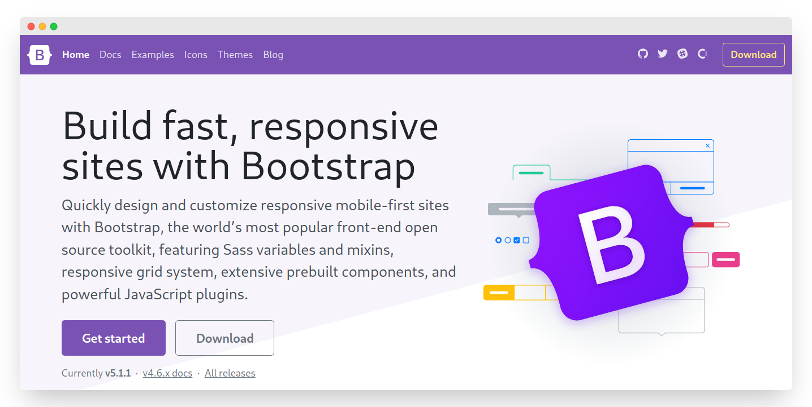
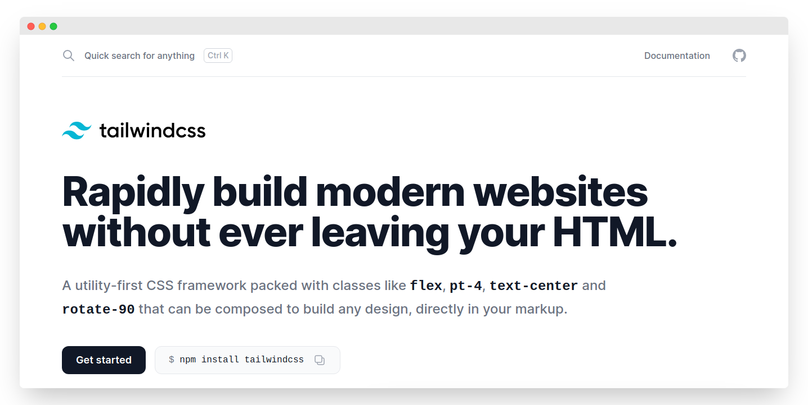
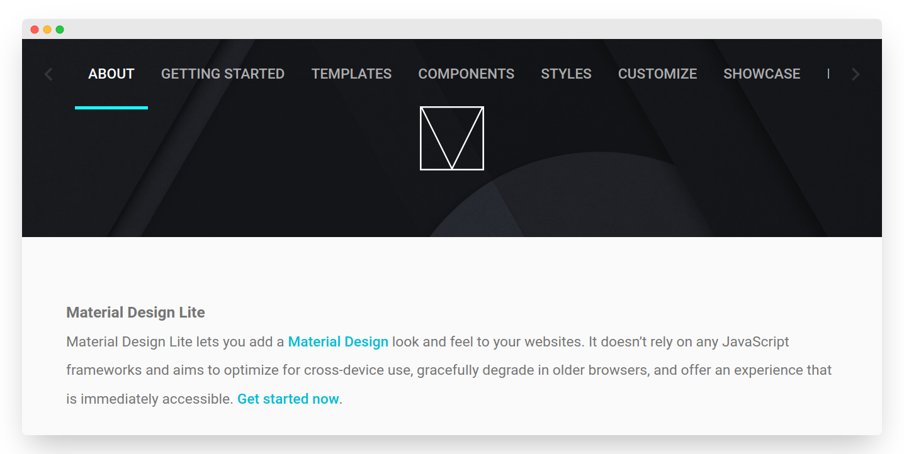
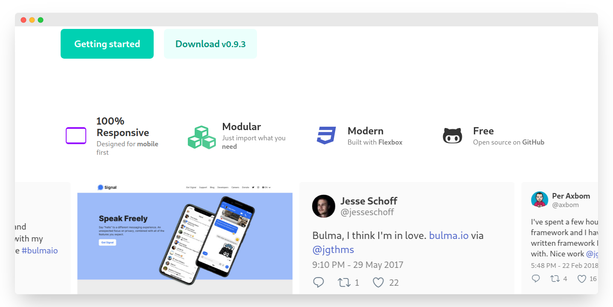
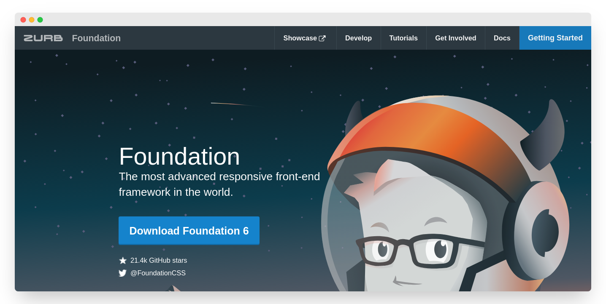
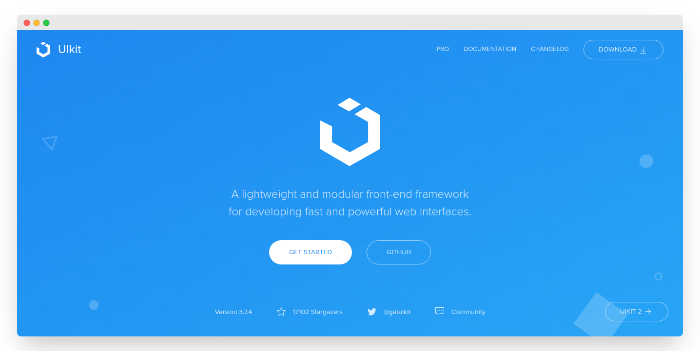

# Best CSS Frameworks

*Hello Dev🖥.  Repo ini berisi kumpulan framework CSS untuk kebutuhan front-end. Daftar framework yang saya kumpulkan dibawah ini bukan hasil survey dari situs-situs programming manapun. Namun hanya sebuah survey pribadi sekaligus dari pendapat teman-teman programmer di sekitar saya.*

 1. **Bootstrap**
    
    

 2. **Tailwind CSS**
    
    

 3. **Material Design Lite**
    
    

 4. **Bulma**
    
    

 5. **Foundation**
    
    

 6. **UIKit**
   
    

### Contributes
*Silahkan berkontribusi untuk mengedit, memperbaiki, atau bahkan ingin menambahkan🙌*